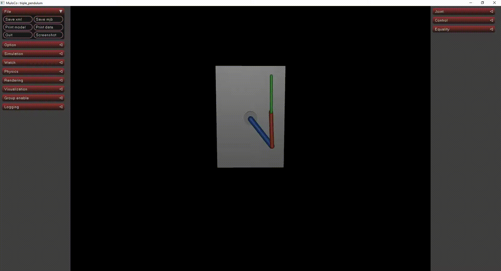

# Robotics with MuJoCo

Learning to create and control robots in MuJoCo.

### Current Progress

* PID controller for balancing a triple pendulum

### Next

Currently working on using Reinforcement Learning to control more complex robots.
